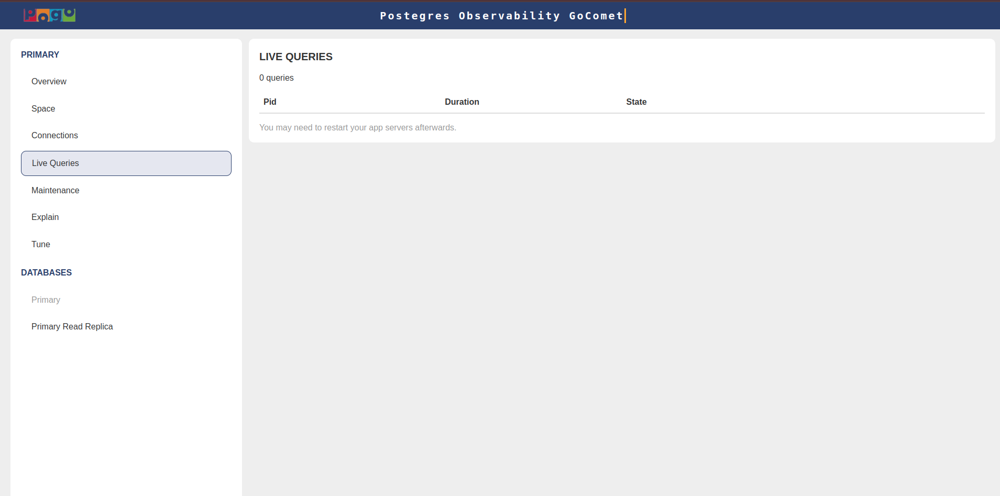

# PgHero

A performance dashboard for Postgres

### Overview

### Space

### Connections

### Live Queries

### Maintenance

### Explain

### Tune

## Documentation

PgHero is available as a Docker image, Linux package, and Rails engine.

Select your preferred method of installation to get started.

- [Docker](guides/Docker.md)
- [Linux](guides/Linux.md)
- [Rails](guides/Rails.md)

## Credits

A big thanks to .....

